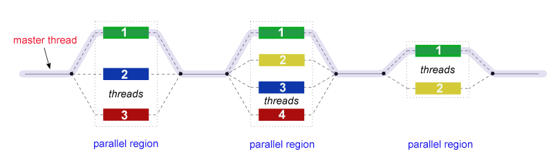

## OpenMP Resources along with Examples

This repo contains some resources that I found useful for learning OpenMP.

#

## OpenMP

OpenMP is an API for programming multi-threaded parallelism in shared address space machines. The API supports C/C++ and Fortran for a variety of architectures. Following are the 3 constructs of the API:

1. Compiler Directives
2. Run-time Library Routines
3. Environment Variables

In the following sections, I start with a few key concepts about the API and then deep dive into some constructs along with some examples. I also plan to publish some benchmarks using this API on my 12-core [Intel Xeon](https://ark.intel.com/content/www/us/en/ark/products/91767/intel-xeon-processor-e5-2650-v4-30m-cache-2-20-ghz.html) rig.

#
## Some Key Concepts

### Fork-Join Model:
OpenMP supports multi-threading for shared memory architectures, which means we need a model for multi-threading. OpenMP defines a fork-join model, where the process starts sequentially on a master thread. When a compiler directive is given for parallel processing, master thread is split into multiple parallel threads (collectively called a team). When the parallel region is complete, threads in the team join back into the master for serial processing. One way to think about it is - If there are 10 threads in the parallel region, mentally copy paste the code 10 times, each snippet going into one of the threads.

### Compiling:
Code with OpenMP must be compiled with some special instructions for the compiler to resolve and bind the directives. For GCC, you can use: 
`gcc -fopenmp hello_world.c -o hello_world` 

## Compiler Directives
Compiler Directives are of the for `#pragma omp directive [optional clauses]`. Some of the commonly used directives can be categorized as follows:
1. Parallel Region - `#pragma omp parallel`
2. Work-Sharing - `#pragma omp [x]: x in {for, section, single}`
3. Synchronization - `#pragma omp [x]: x in {master, critical, barrier, atomic, flush, ordered}`
4. Data Scoping - `#pragma omp [x]: x in {private, firstprivate, lastprivate, shared, default, reduction, threadprivate, copyin, copyprivate}`

## Run-Time Library Routines

## Environment Variables

## Miscellaneous
1. Data Scoping
2. Directive binding
3. Nested Parallelism

## References
1. [OpenMP](https://computing.llnl.gov/tutorials/openMP/  ) by Lawrence Livermore National Laboratory
2. Ch-7 from [Intro to Parallel Computing](https://www.amazon.com/Introduction-Parallel-Computing-Ananth-Grama/dp/0201648652)
3. Set/Unset environment variables in linux - https://www.tecmint.com/set-unset-environment-variables-in-linux/